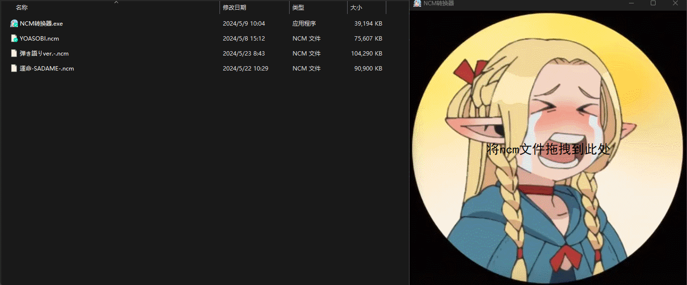

# ncm -> flac converter

[English](./README_EN.md) | [中文](./README.md)

## 概述

将.ncm格式音频文件转换为flac格式，提供windows客户端和WEB两种使用方式。

## 使用

### 客户端使用：
在[releases](https://github.com/lissettecarlr/ncmdump/releases)中下载后直接运行，目前只编译了windows版本，其他平台可以直接运行代码

界面效果：


----------------------

### 网页使用
目前部署在Streamlit中：[](https://ncmdump.streamlit.app/)


界面效果:


##  环境
如果要运行代码，则需要安装对应的库

基础环境：
```bash
pip install mutagen
pip install pycryptodome
```

GUI环境：
```bash
pip install PyQt6
pip install pyinstaller
```

WEB环境：
```bash
pip install streamlit
pip install humanize
pip install pydub
```

如果你毕竟懒，可以直接全安装：
```bash
pip install -r requirements.txt
```

## 运行

### GUI

需要先安装基础环境和GUI环境

直接运行：
```bash
python gui.py
```

or

编译成可执行文件：
```bash
pyinstaller --onefile --add-data="file:file" -wF -i file/favicon-32x32.png -n "NCM转换器" .\gui.py
```


### WEB
需要先安装基础环境和WEB环境
运行：
```bash
streamlit run web.py --server.port 1111
```


