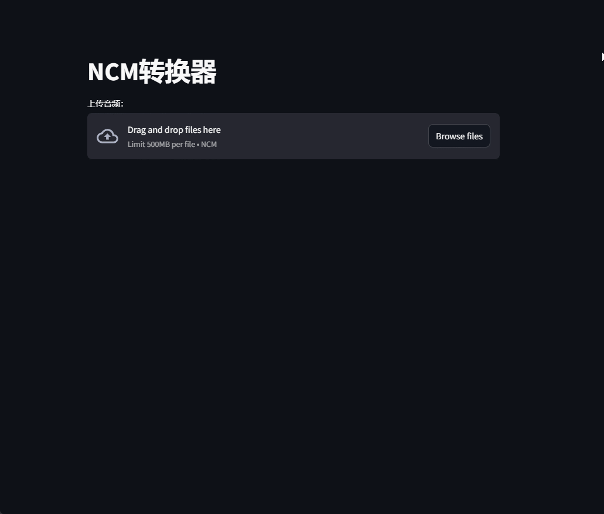

# 🎵 NCM格式转换工具

[](https://www.python.org/)
[](LICENSE)
[](https://ncmdump.streamlit.app/)

<div align="center">
  <a href="./README_EN.md">English</a> •
  <a href="./README.md">中文</a>
</div>

## 📋 概述

这是一个将抑云音乐的.ncm格式音频文件转换为flac格式的工具，提供Windows客户端和Web两种使用方式。

## 使用方法

### 🖥️ 客户端使用

在[releases](https://github.com/lissettecarlr/ncmdump/releases)页面下载最新版本后直接运行，目前只编译了Windows版本，其他平台可以直接运行源代码。

操作演示：
* 拖拽文件到界面中
* 双击界面打开文件选择对话框


### 🌐 Web使用

部署在了Streamlit上，点击右侧图标跳转： [](https://ncmdump.streamlit.app/)

操作演示：
* 当音频文件比较大的时候，上传还是需要一定时间，毕竟是白嫖Streamlit。下列演示是因为本地跑的，所以秒传。



---------

## ⚙️ 环境配置

如果需要从源代码运行，需要安装以下依赖：

### 基础环境

```bash
pip install mutagen
pip install pycryptodome
```

### GUI环境

```bash
pip install PyQt6
pip install pyinstaller
```

### Web环境

```bash
pip install streamlit
```

### Docker环境

```bash
docker build -t ncmdump .
docker run -d -p 23231:23231 ncmdump
```

如果想一次安装所有依赖：

```bash
pip install -r requirements.txt
```

## 🚀 运行方法

### GUI程序

需要先安装基础环境和GUI环境

直接运行：
```bash
python gui.py
```

或者编译成可执行文件：
```bash
pyinstaller --onefile --add-data="file:file" -wF -i file/favicon-32x32.png -n "NCM_Tool" .\gui.py
```

### Web应用

需要先安装基础环境和Web环境

运行：
```bash
streamlit run web.py --server.port 1111 --server.maxUploadSize=500
```

参数说明：
- `--server.port 1111`：设置服务端口为1111
- `--server.maxUploadSize=500`：设置最大上传文件大小为500MB


