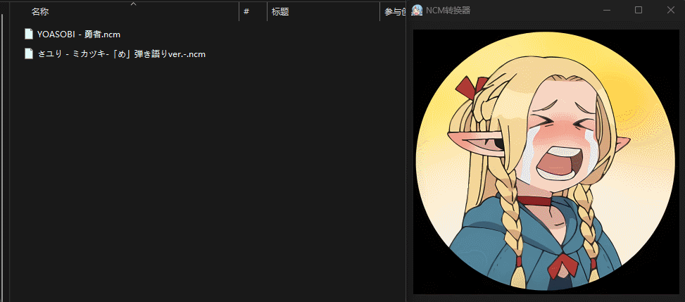

# ncm -> flac converter

将.ncm格式音频文件转换为flac格式，提供windows客户端和WEB两种使用方式。

## 1 环境

基本环境：
```bash
pip install mutagen
pip install pycryptodome
```

GUI额外环境：
```bash
pip install PyQt6
pip install pyinstaller
```

WEB额外环境：
```bash
pip install streamlit
```

全安装：
```bash
pip install -r requirements.txt
```

## 2 使用

### 2.1 GUI

运行：
```bash
python gui.py
```

编译：
```bash
pyinstaller --onefile --add-data="file:file" -wF -i file/favicon-32x32.png -n "NCM转换器" .\gui.py
```

效果:



### 2.2 WEB

运行：
```bash
streamlit run web.py --server.port 1111
```

效果:

